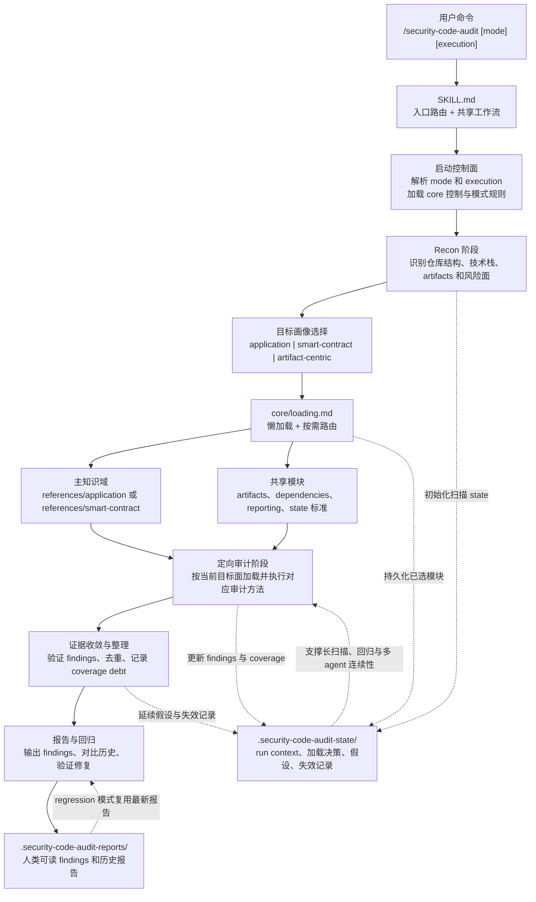

# security-code-audit

面向 Web/API、后端、全栈和智能合约仓库的代码安全审计 skill。

`security-code-audit` 适合代码安全审计、SAST 风格分析、OWASP 风格检查、依赖审计、智能合约审计和修复回归验证。重点是基于真实代码、真实攻击面和可利用性来产出高信号 findings，而不是只做浅层模式匹配。

## 1. 使用方式

- `/security-code-audit`
  默认完整审计。等价于 `standard single`。
- `/security-code-audit quick`
  快速高风险初筛。
- `/security-code-audit deep`
  深度审计，覆盖更强，攻击链和验证更深。
- `/security-code-audit regression`
  以最近一份报告为基线做修复回归验证。
- `/security-code-audit help`
  显示参数、模式、执行方式和示例。

参数：
- 深度：`quick` | `standard` | `deep` | `regression`
- 执行模式：`single` | `multi`
- `multi` 是 beta；如果宿主不支持 delegation，会自动回退到 `single`

示例：
- `/security-code-audit deep multi`
- `/security-code-audit regression`
- `/security-code-audit deep --agents=multi`

## 2. 特性

- 按目标切换知识域
  RECON 后自动区分 application 和 smart-contract，避免把不同类型目标强行套进同一套审计逻辑。
- 基于真实代码和证据
  finding 需要落到真实文件、真实利用路径和可执行的最小修复建议。
- 枚举重复问题
  不只报第一个命中点，而是尽量找全同类高价值位置。
- 证据分层
  主 findings 只保留已确认问题，高信号但未证实的内容会进入 candidate signals，而不是被静默丢掉。
- 覆盖依赖和 artifact 面
  代码、依赖、markdown/prompt、API spec、notebook、配置和 IaC 都能进入同一套审计流程。
- 历史与回归支持
  `.security-code-audit-reports/` 保存人类可读报告，`regression` 可直接基于最新报告做修复回归。
- 大仓库精度保持
  `.security-code-audit-state/` 保存紧凑的 run context，减少长扫描过程中的上下文压缩和漂移。
- 覆盖债务可见
  对于 partial、blocked、invalidated 的审计面，会显式记录成 coverage debt，而不是假装已经扫完。
- deep/multi 假设附录
  在 `deep` 或 beta `multi` 下，重要但尚未闭环的攻击链或信任边界假设会进入专门附录，而不是淹没在扫描过程记录里。
- 可选多 agent
  `multi` 可在大仓库里扩覆盖，但仍保持单一报告出口。

## 3. 架构

运行时架构：分阶段扫描、按目标路由、按需加载，并通过持久化 state 保持长扫描和回归的一致性。

这套 skill 按层拆分：

- `SKILL.md`
  主路由和共享流程。
- `core/`
  防幻觉、覆盖、finding、一致性和懒加载控制。
- `profiles/`
  RECON 后的目标语义：application、smart-contract、artifact-centric。
- `references/application/`
  Web/API/后端审计主知识域。
- `references/smart-contract/`
  智能合约审计主知识域。
- `references/shared/`
  artifacts、dependencies、reporting 和 audit-state 的共享标准。
- `modes/`
  `quick`、`standard`、`deep`、`regression`。

输出层：
- `.security-code-audit-reports/`
  人类可读 findings 和历史报告。
- `.security-code-audit-state/`
  机器可读的 run context 和重审提示，适用于大规模、长耗时或高复杂度扫描。
