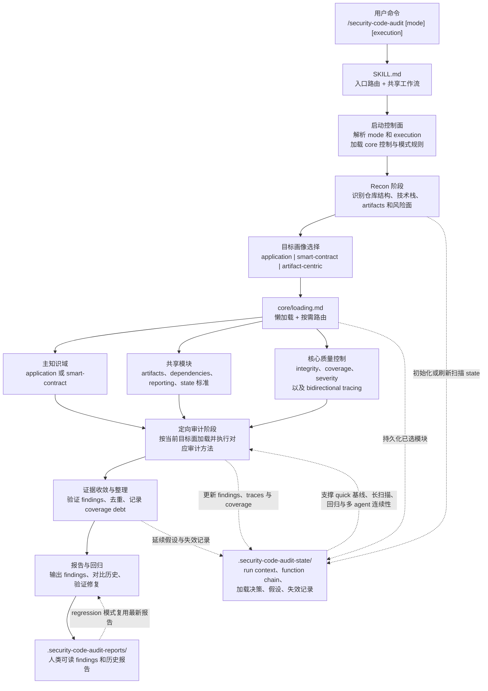

# security-code-audit

当前版本：`v1.0.5`

面向 Web/API、后端、全栈、智能合约，以及 artifact-centric 仓库的代码安全审计 skill。

`security-code-audit` 适合代码安全审计、SAST 风格分析、OWASP 风格检查、依赖审计、智能合约审计、artifact 与 prompt 面审计，以及修复回归验证。重点是基于真实代码、真实攻击面、bounded tracing、持久化 audit state 和高信号报告，而不是只做浅层模式匹配。

English documentation: [README.md](README.md)

## 1. v1.0.5 更新

- 按目标画像路由
  RECON 之后会先区分 execution mode、target profile 和 primary knowledge domain，避免把 `application`、`smart-contract`、`artifact-centric` 混成同一条扫描路径。
- 每次运行都启用 audit state
  `.security-code-audit-state/` 现在服务于所有 run，用来保存 surface inventory、bounded function chain、失效记录，以及 quick 模式的增量基线。
- tracing 和历史比对更强
  新的 bidirectional tracing、基于 fingerprint 的历史匹配，以及 historical-miss gate 能减少浅扫和“误判已经修复”。
- 覆盖面扩展
  对 authentication 和 authorization drift、API version drift、mass assignment、deserialization、path traversal、prompt injection、SSRF、XSS、accounting、workflow replay、limits 和 quotas 的指导更完整。
- 报告信号更清晰
  报告会更明确地区分 confirmed findings、candidate signals、coverage debt、historical context、working hypotheses 和 counted coverage summary。

## 2. 使用方式

- `/security-code-audit`
  默认完整审计。等价于 `standard single`。
- `/security-code-audit quick`
  快速高风险初筛。
- `/security-code-audit deep`
  深度审计，覆盖更强，攻击链和验证更深。
- `/security-code-audit regression`
  以最近一份报告为基线做修复回归验证。
- `/security-code-audit help`
  显示参数、模式、执行方式和示例。

参数：
- 深度：`quick` | `standard` | `deep` | `regression`
- 执行模式：`single` | `multi`
- `multi` 是 beta；如果宿主不支持 delegation，会自动回退到 `single`

示例：
- `/security-code-audit deep multi`
- `/security-code-audit regression`
- `/security-code-audit deep --agents=multi`

## 3. 核心能力

- 按目标面路由
  RECON 后先选择 target profile，再根据实际 surface 路由到主知识域和共享模块。
- 基于真实代码和证据
  finding 需要落到真实文件、真实利用路径和可执行的最小修复建议。
- bounded tracing
  双向 tracing 会把 source-to-sink 和 state-transition 分析收敛到真实信任边界，而不是无限制扩图。
- 枚举重复问题
  不只报第一个命中点，而是尽量找全同类高价值位置。
- audit state 连续性
  `.security-code-audit-state/` 保存紧凑 run context、loaded-module 决策、function-chain 记录和 invalidation，帮助每次运行快速重新对齐上下文。
- 覆盖依赖和 artifact 面
  代码、依赖、markdown、prompt、API spec、notebook、配置和 IaC 都能进入同一套审计流程。
- 覆盖债务可见
  对于 partial、blocked、invalidated 的审计面，会显式记录成 coverage debt，而不是假装已经扫完。
- 证据分层
  主 findings 只保留已确认问题，高信号但未证实的内容会进入 candidate signals 或 working hypotheses，而不是被静默丢掉。
- 历史与回归支持
  `.security-code-audit-reports/` 保存人类可读报告，`regression` 可基于最近报告做回归验证，并配合当前扫描结果做历史比对。
- 可选多 agent
  `multi` 可在大仓库里扩覆盖，但仍保持单一报告出口。

## 4. 架构

运行时架构：分阶段扫描、按目标画像路由、按需加载，并通过 bounded tracing 和持久化 state 保持一致性。

这套 skill 按层拆分：

| 路径 | 作用 |
| --- | --- |
| `SKILL.md` | 主路由、help path、共享流程和进度规则 |
| `core/` | integrity、coverage、findings、severity、懒加载和 bidirectional tracing 控制 |
| `profiles/` | RECON 后的目标语义：`application`、`smart-contract`、`artifact-centric` |
| `references/application/` | Web/API/后端审计主知识域 |
| `references/smart-contract/` | 智能合约与链上逻辑审计主知识域 |
| `references/shared/` | artifact、dependency、reporting 和 audit-state 的共享标准 |
| `modes/` | `quick`、`standard`、`deep`、`regression` 的深度契约 |

输出层：

| 路径 | 作用 |
| --- | --- |
| `.security-code-audit-reports/` | 人类可读 findings、历史、回归基线和 action items |
| `.security-code-audit-state/` | 机器可读 run context、surface inventory、function chain、hypothesis 和 invalidation，适用于每次运行 |
