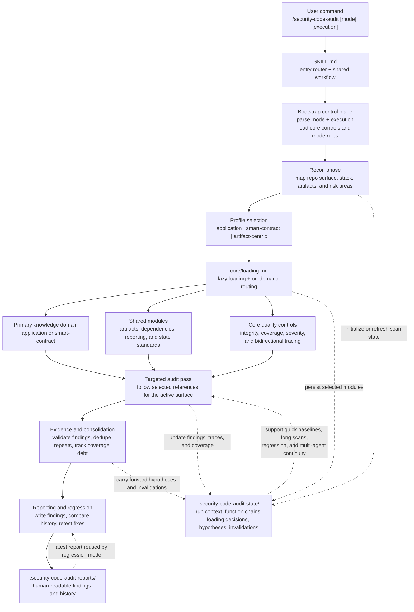

# security-code-audit

Current release: `v1.0.5`

Code security audit skill for web/API, backend, full-stack, smart-contract, and artifact-centric repositories.

`security-code-audit` is designed for code security review, SAST-style analysis, OWASP-style checks, dependency auditing, smart-contract review, artifact and prompt-surface review, and remediation retest. It focuses on real code, exploitability, bounded tracing, persistent audit state, and high-signal reporting instead of shallow pattern matching.

Chinese documentation: [README-CN.md](README-CN.md)

## 1. What's New in v1.0.5

- Profile-aware audit routing
  Recon now separates execution mode, target profile, and primary knowledge domain so `application`, `smart-contract`, and `artifact-centric` targets do not get flattened into one workflow.
- Always-on audit state
  `.security-code-audit-state/` now supports every run and preserves surface inventories, bounded function chains, invalidations, and quick-mode incremental baselines.
- Stronger tracing and history replay
  Bidirectional tracing, fingerprint-based history matching, and historical-miss gates reduce both shallow scans and false "fixed" conclusions.
- Expanded coverage
  The reference set now goes deeper on authentication and authorization drift, API-version drift, mass assignment, deserialization, path traversal, prompt injection, SSRF, XSS, accounting, workflow replay, and limits or quota abuse.
- Higher-signal reporting
  Reports more clearly separate confirmed findings, candidate signals, coverage debt, historical context, working hypotheses, and counted coverage summaries.

## 2. Usage

- `/security-code-audit`
  Default full audit. Equivalent to `standard single`.
- `/security-code-audit quick`
  Fast high-risk triage.
- `/security-code-audit deep`
  Exhaustive review with stronger verification and attack-chain depth.
- `/security-code-audit regression`
  Retest the latest report and verify whether fixes actually hold.
- `/security-code-audit help`
  Show parameters, modes, execution options, and examples.

Parameters:
- depth: `quick` | `standard` | `deep` | `regression`
- execution: `single` | `multi`
- `multi` is beta and falls back to `single` if the host cannot delegate

Examples:
- `/security-code-audit deep multi`
- `/security-code-audit regression`
- `/security-code-audit deep --agents=multi`

## 3. Core Capabilities

- Target-aware routing
  Recon selects a target profile first, then routes into the right knowledge domain and shared modules for the observed surface.
- Real-code focus
  Findings are expected to be tied to actual file locations, exploit paths, and concrete minimal fixes.
- Bounded tracing
  Bidirectional tracing keeps source-to-sink and state-transition analysis focused on real trust-boundary crossings instead of unbounded graph expansion.
- Repeated-pattern enumeration
  The skill is built to find all materially affected locations, not just the first hit.
- Audit-state continuity
  `.security-code-audit-state/` stores compact run context, loaded-module decisions, function-chain records, and invalidations so every run can re-orient cleanly.
- Dependency and artifact coverage
  Application code, dependencies, markdown and prompt artifacts, API specs, notebooks, config, and IaC surfaces all fit into the same audit flow.
- Honest coverage reporting
  Partial, blocked, or invalidated review areas are carried forward as coverage debt instead of being reported as fully covered.
- Evidence-gated findings
  Main findings stay limited to confirmed issues, while unresolved high-signal cases remain visible as candidate signals or working hypotheses instead of being silently dropped.
- History and regression support
  Findings are compared against `.security-code-audit-reports/`, and `regression` mode can retest the latest report directly after a fresh current-state pass or report-baseline selection.
- Optional multi-agent execution
  `multi` can widen coverage for large repos while keeping a single reporting path.

## 4. Architecture

Runtime architecture: staged scanning with profile routing, lazy loading, bounded tracing, and persistent state.

The skill is intentionally split into layers:

| Path | Purpose |
| --- | --- |
| `SKILL.md` | Router, help path, shared workflow, and progress rules |
| `core/` | Integrity, coverage, findings, severity, lazy loading, and bidirectional tracing controls |
| `profiles/` | Post-recon target semantics: `application`, `smart-contract`, or `artifact-centric` |
| `references/application/` | Primary methodology for web/API/backend audits |
| `references/smart-contract/` | Primary methodology for Solidity and on-chain audits |
| `references/shared/` | Shared artifact, dependency, reporting, and audit-state standards |
| `modes/` | `quick`, `standard`, `deep`, and `regression` depth contracts |

Output layers:

| Path | Purpose |
| --- | --- |
| `.security-code-audit-reports/` | Human-readable findings, history, regression baselines, and action items |
| `.security-code-audit-state/` | Machine-readable run context, surface inventories, function chains, hypotheses, and invalidations for every run |
