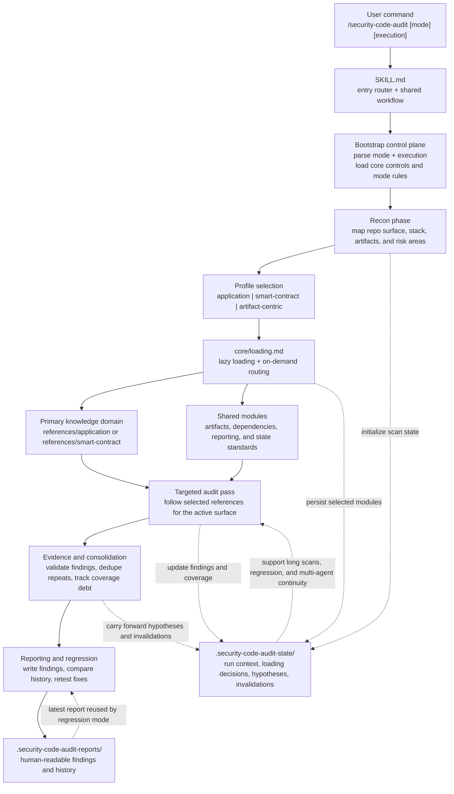

# security-code-audit

Code security audit skill for web/API, backend, full-stack, and smart-contract repositories.

`security-code-audit` is designed for code security review, SAST-style analysis, OWASP-style checks, dependency auditing, smart-contract review, and remediation retest. It focuses on real code, exploitability, and high-signal reporting instead of shallow pattern matching.

Chinese documentation: [README-CN.md](README-CN.md)

## 1. Usage

- `/security-code-audit`
  Default full audit. Equivalent to `standard single`.
- `/security-code-audit quick`
  Fast high-risk triage.
- `/security-code-audit deep`
  Exhaustive review with stronger verification and attack-chain depth.
- `/security-code-audit regression`
  Retest the latest report and verify whether fixes actually hold.
- `/security-code-audit help`
  Show parameters, modes, execution options, and examples.

Parameters:
- depth: `quick` | `standard` | `deep` | `regression`
- execution: `single` | `multi`
- `multi` is beta and falls back to `single` if the host cannot delegate

Examples:
- `/security-code-audit deep multi`
- `/security-code-audit regression`
- `/security-code-audit deep --agents=multi`

## 2. Features

- Domain-aware auditing
  Recon selects the right knowledge domain so web/API and smart-contract audits do not get flattened into the same checklist.
- Real-code focus
  Findings are expected to be tied to actual file locations, exploit paths, and concrete minimal fixes.
- Repeated-pattern enumeration
  The skill is built to find all materially affected locations, not just the first hit.
- Evidence-gated findings
  Main findings stay limited to confirmed issues, while unresolved high-signal cases remain visible as candidate signals instead of being silently dropped.
- Dependency and artifact coverage
  Application code, dependencies, markdown/prompt artifacts, API specs, notebooks, and config surfaces all fit into the same audit flow.
- History and regression support
  Findings are compared against `.security-code-audit-reports/`, and `regression` mode can retest the latest report directly.
- Large-repo precision
  `.security-code-audit-state/` stores compact run context and re-audit hints so long scans keep their bearings.
- Honest coverage reporting
  Partial, blocked, or invalidated review areas are carried forward as coverage debt instead of being reported as fully covered.
- Deep/multi hypothesis tracking
  Deep mode and beta `multi` can carry forward material unresolved attack-chain or trust-boundary hypotheses in a dedicated appendix instead of losing them in scan notes.
- Optional multi-agent execution
  `multi` can widen coverage for large repos while keeping a single reporting path.

## 3. Architecture

Runtime architecture: staged scanning with profile routing, on-demand loading, and persistent state.

The skill is intentionally split into layers:

- `SKILL.md`
  Router and shared workflow.
- `core/`
  Anti-hallucination, coverage, findings, severity, and lazy-loading controls.
- `profiles/`
  Target semantics after recon: application, smart-contract, or artifact-centric.
- `references/application/`
  Primary methodology for web/API/backend audits.
- `references/smart-contract/`
  Primary methodology for Solidity and on-chain audits.
- `references/shared/`
  Artifacts, dependencies, reporting, and audit-state standards shared across domains.
- `modes/`
  `quick`, `standard`, `deep`, and `regression`.

Output layers:
- `.security-code-audit-reports/`
  Human-readable findings and history.
- `.security-code-audit-state/`
  Machine-readable run context for large, long-running, or high-complexity scans.
