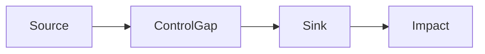

# Finding Detail Standard

Each finding entry should be specific enough that another engineer can reproduce, triage, and fix it without re-running the entire audit.

---

## Required Fields

Confirmed findings are schema-first. Before writing Markdown, create one
canonical `finding.v1` JSONL record in
`output/security-code-audit-{YYYY-MM-DD-HHMMSS}-{mode}-{short-hash}-findings.jsonl` for each confirmed
finding.

Required `finding.v1` fields:

- `schema_version`
- `fingerprint`
- `severity`
- `maturity`
- `category_surface`
- `locations`
- `status`
- `title`
- `description`
- `attack_vector`
- `impact`
- `poc`
- `evidence`
- `evidence_chain`
- `minimal_fix`
- `hardening`
- `related_findings`
- `evidence_refs`

Derived or override fields:

- `mermaid`
  Optional Mermaid override for the attack or data-flow path. If omitted, the
  renderer generates `Attack Flow` from `evidence_chain`.

Markdown field names are rendered from those canonical fields as:
`Severity`, `Maturity`, `Category / Surface`, `Fingerprint`, `Location`,
`Status`, `Evidence Observation Refs`, `Description`, `Attack Vector`,
`Impact`, `PoC`, `Evidence`, `Minimal Fix`, `Hardening`, and
`Related Findings`.

`poc`, `evidence`, `minimal_fix`, and `hardening` may be either strings or
structured Markdown objects. For code blocks, prefer:

```json
{"language": "bash", "code": "curl 'https://target/lookup?host=example.com;id'\n# success signal: uid="}
```

## Optional Context Fields

- `Build Context`
  Use for smart-contract findings when `pragma`, actual compiler, optimizer, proxy model, or key dependency version materially affects exploitability, severity confidence, or remediation compatibility.
- `Deployment Context`
  Use when host-app auth, reverse-proxy policy, mount prefix, service placement, or network reachability materially affects exploitability, severity confidence, or residual risk.

---

## Writing Rules

- Treat `output/security-code-audit-{YYYY-MM-DD-HHMMSS}-{mode}-{short-hash}-findings.jsonl` as the source of truth for confirmed findings.
- Prefer `tools/report_render.py` to render `Confirmed Findings` from
  that canonical findings JSONL; if the tool is unavailable, hand-render the
  same fields and record `external_validator_unavailable`.
- Run or apply the equivalent of `tools/report_gate_check.py` before finalizing
  the report. Reports with missing canonical fields or unstable display IDs are
  not final.
- Display IDs such as `[HIGH]-001` are generated from sorted canonical records:
  severity rank, then `category_surface`, then `fingerprint`, numbering within
  each severity. Do not number findings by discovery order.
- `evidence_chain` is required for every confirmed finding. It must contain the
  source or entry point, propagation or missing control, sink or state
  transition, and impact signal.
- For smart-contract findings, the evidence chain must also identify the
  caller/role, attacker-controlled token/recipient/spender/route/amount, the
  authorization result, the relevant state key, any delegatecall/CPI/adapter or
  callback semantics, the actual balance or authority delta, and the violated
  invariant. If one of these depends on an external deployment or solver, keep
  the assumption as a proof obligation or coverage debt instead of filling the
  gap with a mock or function name.
- Keep reproduction and evidence fields as readable Markdown. Do not collapse
  PoC, evidence, minimal fixes, or multi-step chains into one long string when
  code fences, numbered steps, or an attack-flow diagram would preserve intent.
- Include `mermaid` only when the generated attack flow needs a hand-authored
  diagram; otherwise let the renderer derive it from `evidence_chain`.
- Keep the description factual and exploit-centered.
- Use real file paths and line numbers from inspected code.
- List all affected locations when the same pattern repeats.
- Keep the fingerprint stable across line moves and refactors when the exploit path is still the same.
- Group multiple downstream exploit paths into one finding only when the failed control, trust boundary, and minimal fix are materially shared.
- Keep operator-significant exploit paths obvious in the title, `Attack Vector`, `Impact`, `Related Findings`, and attack-chain narrative without splitting findings by default.
- Quote only the minimum relevant code needed to prove the issue.
- Distinguish direct impact from chain impact if the issue compounds with others.
- Main finding entries should use `Maturity: Confirmed`.
- Candidate entries belong in a separate `Candidate Signals` section and should follow `evidence-standard.md`.
- `Minimal Fix` must be exploit-breaking and execution-preserving; avoid proposing patches that would self-revert or disable the intended happy path.
- `Build Context` is advisory context, not a dismissal mechanism. Use it to sharpen exploitability and remediation accuracy, not to auto-close a finding just because the repo is on an older or newer compiler line.
- `Deployment Context` is advisory context, not a dismissal mechanism. Use it to record real exposure and compensating boundaries without calling the underlying code weakness fixed unless the exploit path is materially broken.
- Use `Pending historical validation` only when the finding is confirmed but lifecycle labels are withheld because the post-scan historical-miss gate failed for the run.

---

## Minimal Entry Shape

```markdown
### [SEV]-[NNN]: [Title]
- **Severity**: Critical / High / Medium / Low / Info
- **Maturity**: Confirmed
- **Category / Surface**: [C1-C12 label or smart-contract surface]
- **Fingerprint**: [stable finding fingerprint]
- **Location**: `file/path.ext:line`
- **Status**: New / Recurring / Regression / Pending historical validation
- **Evidence Observation Refs**: [current-run evidence ids]
- **Description**: [What is wrong in the actual code path]
- **Attack Vector**: [Shortest credible exploit path]
- **Impact**: [What the attacker gains]
- **Build Context**: [Optional, only when version/dependency reality materially matters]
- **Deployment Context**: [Optional, only when host-app auth, reverse proxy, mount path, or network placement materially changes exploitability or residual risk]
- **PoC**:
```[lang]
[Concrete payload, request, command, or step script]
```
- **Evidence Chain**:
  1. [Untrusted source]
  2. [Propagation / missing control]
  3. [Sink or state transition]
- **Evidence**:
```[lang]
// Actual vulnerable code
```
- **Attack Flow**:

- **Minimal Fix**: [Smallest real change that breaks exploitation]
```[lang]
// Minimal patch
```
- **Hardening**: [Optional follow-up]
- **Related Findings**: [Cross references]
```
